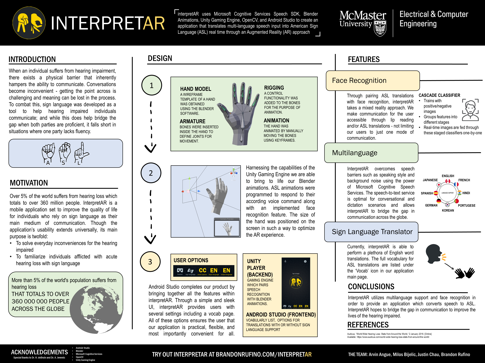

# Repository for interpretAR 

This project uses Microsoft Cognitive Services Speech SDK, Blender Animations, Unity Gaming Engine, OpenCV, and Android Studio to create an application that translates speech input into American Sign Language (ASL) real time through an Augmented Reality (AR) approach.

## News

* interpretAR Version 1.0 COMPLETE! Download current version for multi-language speech to text integrated with your mobile camera
* ASL voice translation functional! Take a gander at the vocab page to see all the words you can translate in ASL
* Over 100 words of sign language and growing
  
  Demo version 1.0 release date: April 9th 2019 -DONE

## Features

This repository hosts interpretAR Android Studio Project files:
* Plethora of ASL vocabulary for the best user experience
* Face recognition for a responsive AR environment
* Multi-language speech input / output capabilities
* Simple and sleek UI design

We tested the project with Brandon's Samsung S7 Edge with Android version 8.0.0. [Visit Brandon's Website](http://brandonrufino.com/). 

# Try interpretAR on your device

> **Note:**
>THIS PROJECT IS CONTINUALLY BEING UPDATED. Read revision comments for current status of application.

## Prerequisites

* A PC (Windows, Linux, Mac) capable to run Android Studio.
* Version 3.3 of [Android Studio](https://developer.android.com/studio/).
* An ARM-based Android device (API 23: Android 6.0 Marshmallow or higher) [enabled for development](https://developer.android.com/studio/debug/dev-options) with a working microphone.

## Build the project

* **By building this project you will download the Microsoft Cognitive Services Speech SDK. By downloading you acknowledge its license, see [Speech SDK license agreement](https://aka.ms/csspeech/license201809).**
* Clone/download the GitHub repository.
* Open interpretAR folder as a project in Android Studio.
* Press Ctrl+F9, or select **Build** \> **Make Project**.

## Run the project

* Connect your Android device to your development PC.
* Press Shift+F10, or select **Run** \> **Run 'app'**.
* In the deployment target windows that comes up, pick your Android device.
* On your Android device, play with different settings to grasp the full expierence of interpretAR.

## Still curious? Visit our website for more
* [interpretAR Website](https://brandonrufino.com/interpretar/)

## Check out our demo on YouTube:
* [interpretAR Demo - ECE Expo 2019](https://www.youtube.com/watch?v=o11_6Vo2MHo)

## References
* [Blender Hand Model](https://sketchfab.com/3d-models/hand-low-poly-d6c802a74a174c8c805deb20186d1877?fbclid=IwAR0rjTAgqOO27wYq6uFCOKXr_hViTXNGkexEA96wHWuEGJ9F1XQuUKHoGDY)
* [OpenCV Plugin for Unity](https://enoxsoftware.com/opencvforunity/)
* [Face Detection using OpenCV](https://docs.opencv.org/3.4.3/d7/d8b/tutorial_py_face_detection.html)
* [Speech SDK API reference for Java](https://aka.ms/csspeech/javaref)
* [Mobile Speech Recognizer](http://kokosoft.pl/docs/speechrecognition/readme.pdf)
